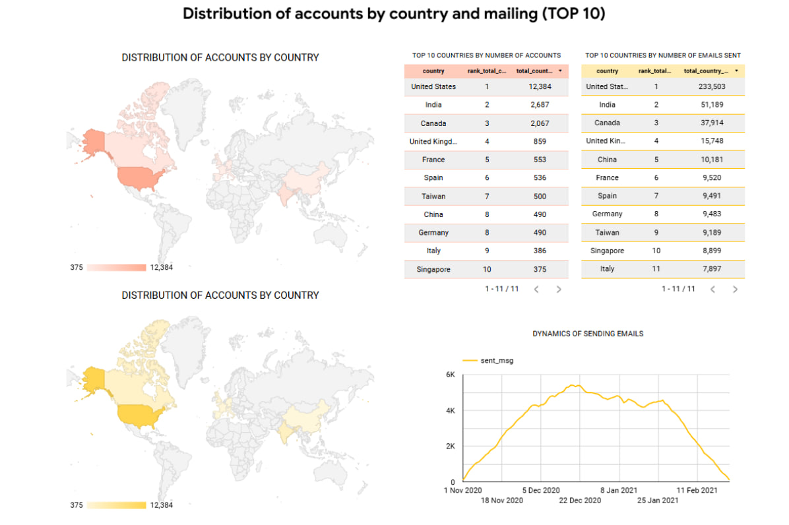

# Account & Email Campaign Analytics

This project provides SQL logic and visual insights for analyzing account registration trends and user engagement with email campaigns across the top 10 countries.

## Overview

The analysis focuses on two core metrics:
- **Account dynamics**: How many accounts are created daily, and from which countries.
- **Email activity**: How many messages were sent, opened, and clicked by users in different regions.

A Tableau (or Looker Studio) dashboard visualizes both geographical and temporal dimensions of these metrics.

## Data Sources

- `account` — user account data including verification and subscription status.
- `account_session`, `session`, `session_params` — user behavior and session metadata.
- `email_sent`, `email_open`, `email_visit` — events related to email campaigns.

## Key SQL Logic

The SQL script includes several steps:

1. **Email Metrics Aggregation**  
   Counts of sent, opened, and clicked emails by country and date.

2. **Account Metrics Aggregation**  
   Number of new accounts, verification status, unsubscriptions, and sending intervals by country.

3. **Unified View (UNION ALL)**  
   Combines both metrics into one dataset for easier ranking and filtering.

4. **Country-Level Aggregation**  
   Calculates totals per country and applies `DENSE_RANK()` to identify the **Top 10 Countries** by:
   - Number of accounts
   - Number of emails sent

## Dashboard Preview

The dashboard contains:
- Choropleth maps showing **account distribution** by country.
- Ranked tables for **Top 10 countries** by accounts and emails sent.
- Time-series chart of **email sending volume**.

## Use Cases

- Marketing team can identify which countries respond best to campaigns.
- Product or data teams can track user activation and engagement funnel.
- Useful for A/B testing segment strategy by country.

- ##  Tech Stack

- **SQL (BigQuery)**
- **Looker Studio**
